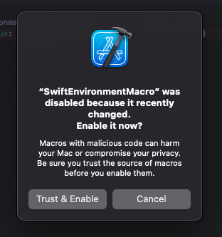

# SwiftEnvironment

SwiftEnvironment is a Swift library designed to simplify environment value management in SwiftUI applications. It provides convenient macros and utilities to streamline the process of defining and injecting environment values.


[](https://app.codacy.com/gh/hainayanda/SwiftEnvironment/dashboard?utm_source=gh&utm_medium=referral&utm_content=&utm_campaign=Badge_grade)
[](https://swift.org/package-manager/)
[](https://github.com/hainayanda/SwiftEnvironment/actions/workflows/test.yml)

## Requirements

- Swift 5.9 or higher
- iOS 13.0 or higher
- MacOS 10.15 or higher
- TVOS 13.0 or higher
- WatchOS 6.0 or higher
- Xcode 15 or higher

## Installation

### Swift Package Manager (Xcode)

To install using Xcode's Swift Package Manager, follow these steps:

- Go to **File > Swift Package > Add Package Dependency**
- Enter the URL: **<https://github.com/hainayanda/SwiftEnvironment.git>**
- Choose **Up to Next Major** for the version rule and set the version to **2.2.0**.
- Click "Next" and wait for the package to be fetched.

### Swift Package Manager (Package.swift)

If you prefer using Package.swift, add SwiftEnvironment as a dependency in your **Package.swift** file:

```swift
dependencies: [
    .package(url: "https://github.com/hainayanda/SwiftEnvironment.git", .upToNextMajor(from: "2.2.0"))
]
```

Then, include it in your target:

```swift
 .target(
    name: "MyModule",
    dependencies: ["SwiftEnvironment"]
)
```

## Usage

This library is designed to allow easier dependency management, using exisiting `EnvironmentValues` from SwiftUI. Adding new environment is very easy:

```swift
// protocol with stub
@Stubbed(type: .class)
protocol MyProtocol {
    func doSomething()
}

// add to EnvironmentValues
@EnvironmentValue
extension EnvironmentValues {
    static let myValue: MyProtocol = MyProtocolStub()
}
```

Then you can use the keyPath in SwiftUI `Environment` or `GlobalEnvironment`:

```swift
@Environment(\.myValue) var switUIValue
@GlobalEnvironment(\.myValue) var globalValue
```

You can inject the dependency to SwiftUI Enviromnent as usual:

```swift
SomeView()
    .environment(\.myValue, SomeDependency())
```

Different than SwiftUI Environment, GlobalEnvironment can be injected and accessed globally:

```swift
GlobalResolver.environment(\.myValue, MyImplementation())
```

### GlobalEnvironment

`GlobalEnvironment` complements SwiftUI Environment. It allows `EnvironmentValues` to be accessed globally outside of SwiftUI injection scope. To use it, add EnvironmentValues just like how we add it for SwiftUI, and inject it into `GlobalResolver`:

```swift
@GlobalEnvironment(\.myValue) var myValue
```

To provide gobal environment use GlobalResolver static methods:

```swift
GlobalResolver
    .environment(\.myValue, SomeDependency())
```

You can connect multiple KeyPaths to one KeyPaths by a single call:

```swift
GlobalResolver
    .environment(\.this, \.that, use: \.myValue)
```

To resolve dependency manually from GlobalResolver, do this:

```swift
let myValue = GlobalResolver.resolve(\.myValue)
```


### EnvironmentValue macro

The `EnvironmentValue` macro is used to remove boilerplate code when adding a new variable to EnvironmentValue. To use it, simply add `@EnvironmentValue` to the extension of `EnvironmentValues` with static variable of your default environmentValue.

```swift
import SwiftEnvironment

@EnvironmentValue
extension EnvironmentValues {
    static let myValue: Dependency = MyDependency()
}
```

This allows you to use `myValue` as a SwiftUI Environment KeyPath argument:

```swift
@Environment(\.myValue) var myValue
```

or for view injection:

```swift
SomeView()
    .environment(\.myValue, SomeDependency())
```

### Stubbed macro on protocols

The `Stubbed` macro simplifies the creation of stubs from protocols, reducing boilerplate code. To use the `Stubbed` macro, simply add `@Stubbed` to the protocol you wish to create a stub for:

```swift
import SwiftEnvironment

@Stubbed(type: .struct)
protocol MyProtocol { 
    var someValue: Int { get }
    func calculate(someValue: Int) -> Int
}
```

This will generate a structure similar to this:

```swift
struct MyProtocolStub { 
    let someValue: Int = 0
    init() { }
    func calculate(someValue: Int) -> Int { return 0 }
}
```

If the return type of the protocol's methods or variables is unknown or you want to customize the value, you can provide the default value using `.value(for: <custom type>.self, <custom default value>)`:

```swift
import SwiftEnvironment

@Stubbed(type: .class, .value(for: MyType.self, MyType()))
protocol MyProtocol { 
    var someValue: MyType { get }
    func calculate(someValue: Int) -> MyType
}
```

You can provide multiple types as variadic parameters.

### Stubbed macro on struct and class

The `Stubbed` macro simplifies the creation of stubs for class or struct, reducing boilerplate code. To use the `Stubbed` macro, simply add `@Stubbed` to the class or struct you wish to create a stub for:

```swift
import SwiftEnvironment

@Stubbed
struct MyStruct { 
    let someValue: Int
    let someString: String
}
```

Then you can get your stub by calling generated static variable .stub:

```swift
let myStructStub = MyStruct.stub
```

If the return type of the protocol's methods or variables is unknown or you want to customize the value, you can provide the default value using `.value(for: <custom type>.self, <custom default value>)`:

```swift
import SwiftEnvironment

@Stubbed(.value(for: MyType.self, MyType()))
struct MyStruct {
    let someValue: MyType
}
```

You can provide multiple types as variadic parameters.

### GlobalResolver environment

Injected values to `GlobalResolver.environment` are injected using `autoclosure`, so the value will be created lazily. This value will be stored as long as the app is alive. You can inject an explicit closure too if needed:

```swift
GlobalResolver
    .environment(\.myValue) { 
        SomeDependency()
    }
```

### GlobalResolver transient

Another injection method for GlobalResolver is `transient`. This method ensures that the value will be newly created when first accessed from GlobalEnvironment property wrapper. To inject, simply call transient from GlobalEnvironment and proceed as usual:

```swift
GlobalResolver
    .transient(\.myValue, SomeDependency())
```

### GlobalResolver weak

Another injection method for GlobalResolver is `weak`. This method ensures that the value will be stored in a weak variable and will be newly created only when the last resolved value is null. To inject, simply call weak from GlobalEnvironment and proceed as usual:

```swift
GlobalResolver
    .weak(\.myValue, SomeDependency())
```

### Enabling Macro on error

XCode will try prevent usage of macros downloaded from the internet. To enable it, tap on the error and choose Trust & Enable.



## Contributing

Contributions are welcome! Please follow the guidelines in the [CONTRIBUTING.md](CONTRIBUTING.md) file.

## License

MosaicGrid is available under the MIT license. See the [LICENSE](LICENSE) file for more info.

## Credits

This project is maintained by [Nayanda Haberty](hainayanda@outlook.com).
